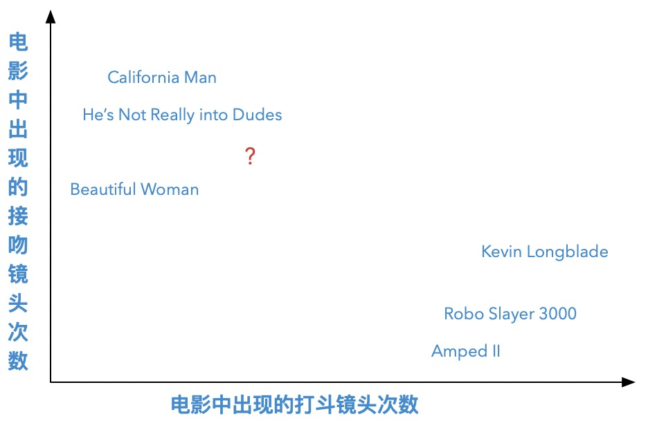
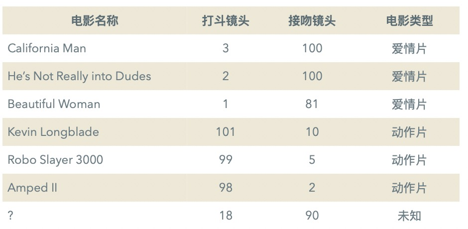
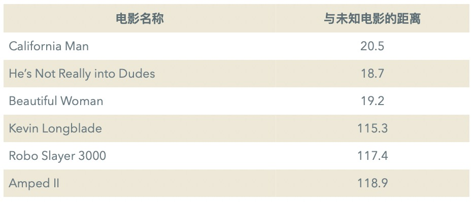

简单地说，k近邻算法采用测量不同特征值之间的距离方法进行分类。

> **k-近邻算法**
> 
> 优点：精度高、对异常值不敏感、无数据输入假定。
> 缺点：计算复杂度高、空间复杂度高。 适用数据范围：数值型和标称型。

它的工作原理是：存在一个样本数据集合，也称作训练样本集，并且样本集中每个数据都存在标签，即我们知道样本集中每一数据与所属分类的对应关系。输入没有标签的新数据后，将新数据的每个特征与样本集中数据对应的特征进行比较，然后算法提取样本集中特征最相似数据（最近邻）的分类标签。一般来说，我们只选择样本数据集中前k个最相似的数据，这就是k-近邻算法中k的出处，通常k是不大于20的整数。最后，选择k个最相似数据中出现次数最多的分类，作为新数据的分类。

现在我们回到前面电影分类的例子，使用k近邻算法分类爱情片和动作片。有人曾经统计过很多电影的打斗镜头和接吻镜头，图2-1显示了6部电影的打斗和接吻镜头数。假如有一部未看过的电影，如何确定它是爱情片还是动作片呢？我们可以使用kNN来解决这个问题。

首先我们需要知道这个未知电影存在多少个打斗镜头和接吻镜头，上图中问号位置是该未知电影出现的镜头数图形化展示，具体数字参见下表

即使不知道未知电影属于哪种类型，我们也可以通过某种方法计算出来。首先计算未知电影与样本集中其他电影的距离，如下表所示。

现在我们得到了样本集中所有电影与未知电影的距离，按照距离递增排序，可以找到k个距离最近的电影。假定k=3，则三个最靠近的电影依次是He’s Not Really into Dudes、Beautiful Woman和California Man。k近邻算法按照距离最近的三部电影的类型，决定未知电影的类型，而这三部电影全是爱情片，因此我们判定未知电影是爱情片。

计算两个向量点xA和xB之间的距离可以使用欧氏距离公式：

^2 + (xA_1 - xB_1)^2})

如果数据集存在4个特征值，则点(1, 0, 0, 1)与(7, 6, 9, 4)之间的距离计算为：

^2 + (6-0)^2 + (9-0)^2 + (4-1)^2})

### 归一化数值

采用的方法是将数值归一化，如将取值范围处理为0到1或者-1到1之间。下面的公式可以将任意取值范围的特征值转化为0到1区间内的值：

k近邻算法是***分类数据***最简单最有效的算法。k近邻算法是基于实例的学习，使用算法时我们必须有接近实际数据的训练样本数据。k近邻算法必须保存全部数据集，如果训练数据集的很大，必须使用***大量的存储空间***。此外，由于必须对数据集中的每个数据计算距离值，实际使用时可能非常***耗时***。

K近邻算法的另一个缺陷是它***无法给出任何数据的基础结构信息***，因此我们也无法知晓平均实例样本和典型实例样本具有什么特征。下一章我们将使用概率测量方法处理分类问题，该算法可以解决这个问题。