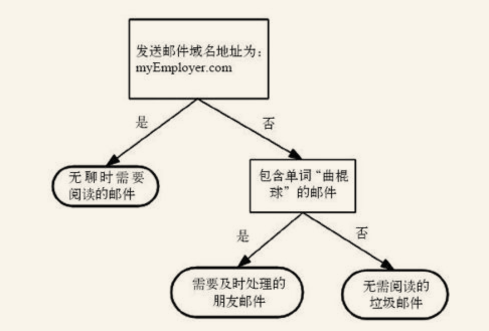

k-近邻算法可以很好地完成分类任务，但是它最大的缺点就是无法给出数据的内在含义，决策树的主要优势就在于数据形式非常容易理解。

本章构造的决策树算法能够读取数据集合，构建类似于图3-1的决策树。决策树的一个重要任务是为了数据中所蕴含的知识信息，因此决策树可以使用不熟悉的数据集合，并从中提取出一系列规则，在这些机器根据数据创建规则时，就是机器学习的过程。专家系统中经常使用决策树，而且决策树给出结果往往可以匹敌在当前领域具有几十年工作经验的人类专家。

> **决策树**
>
> 优点：计算复杂度不高，输出结果易于理解，对中间值的缺失不敏感，可以处理不相关特征数据。
> 缺点：可能会产生过度匹配问题。
> 适用数据类型：数值型和标称型。

在构造决策树时，我们需要解决的第一个问题就是，当前数据集上哪个特征在划分数据分类时起决定性作用。为了找到决定性的特征，划分出最好的结果，我们必须评估每个特征。完成测试之后，原始数据集就被划分为几个数据子集。这些数据子集会分布在第一个决策点的所有分支上。如果某个分支下的数据属于同一类型，则当前无需阅读的垃圾邮件已经正确地划分数据分类，无需进一步对数据集进行分割。如果数据子集内的数据不属于同一类型，则需要重复划分数据子集的过程。如何划分数据子集的算法和划分原始数据集的方法相同，直到所有具有相同类型的数据均在一个数据子集内。
